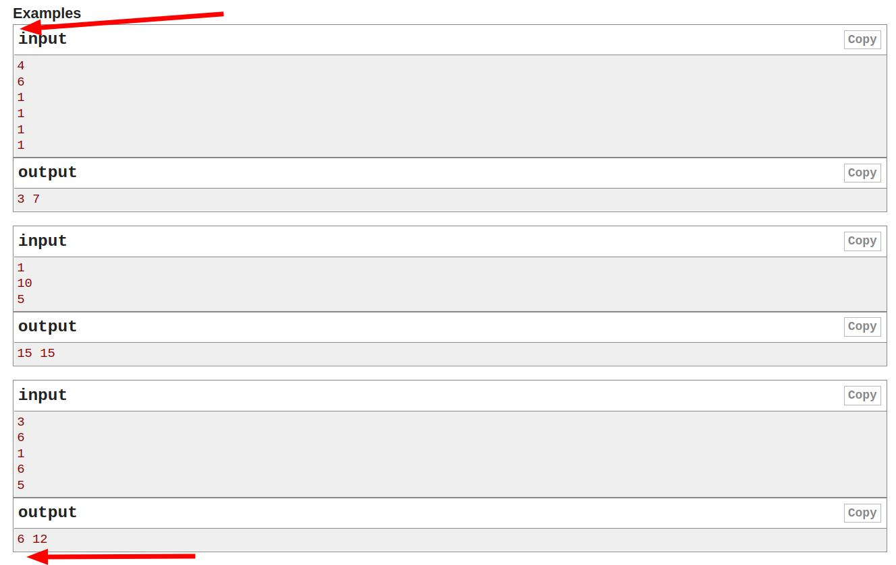

# codeforces parse and create tests

lazy copy pasting...

copy to clipboard from here to here


and then run 

```bash
python3 create_tests.py <<< $(xclip -o)
```

(directory structure after the command)
```
├── test_1
│   ├── input.txt
│   └── output.txt
├── test_2
│   ├── input.txt
│   └── output.txt
├── test_3
│   ├── input.txt
│   └── output.txt
└── test_4
    ├── input.txt
    └── output.txt
```

compile main.cpp (`a` file)
```
g++ -Wall -Wextra -Wshadow -D_GLIBCXX_ASSERTIONS -ggdb3 -fmax-errors=2 -o a main.cpp
```

(directory structure after the command)
```
├── a
├── main.cpp
├── test_1
│   ├── input.txt
│   └── output.txt
├── test_2
│   ├── input.txt
│   └── output.txt
├── test_3
│   ├── input.txt
│   └── output.txt
└── test_4
    ├── input.txt
    └── output.txt
```

test all cases with:

```bash
test.sh
```
