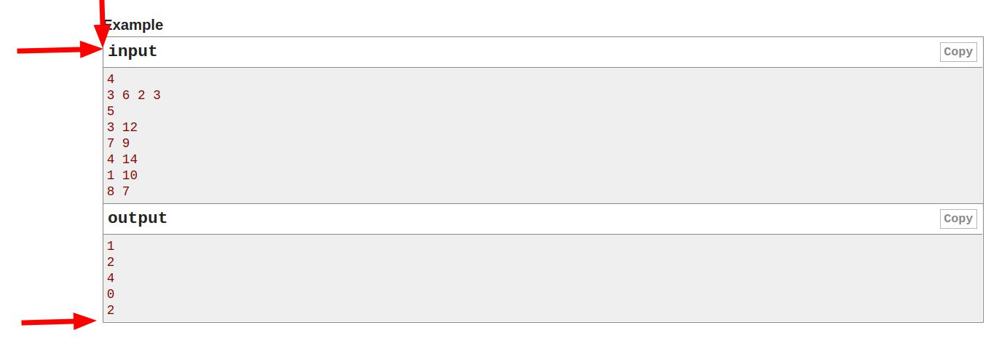

# codeforces parse and create tests

## 1. Copy test cases from here to here:



clipboard example:
```
inputCopy
4
3 6 2 3
5
3 12
7 9
4 14
1 10
8 7
outputCopy
1
2
4
0
2
```

## 2. Run create_tests.py

```bash
python3 create_tests.py <<< $(xclip -o)
```

(directory structure after the command)
```
├── test_1
│   ├── input.txt
│   └── output.txt
├── test_2
│   ├── input.txt
│   └── output.txt
├── test_3
│   ├── input.txt
│   └── output.txt
└── test_4
    ├── input.txt
    └── output.txt
```

## 3. compile main.cpp -> a file
```
g++ -Wall -Wextra -Wshadow -D_GLIBCXX_ASSERTIONS -ggdb3 -fmax-errors=2 -o a main.cpp
```

(directory structure after the command)
```
├── a
├── main.cpp
├── test_1
│   ├── input.txt
│   └── output.txt
├── test_2
│   ├── input.txt
│   └── output.txt
├── test_3
│   ├── input.txt
│   └── output.txt
└── test_4
    ├── input.txt
    └── output.txt
```

## 4. test all cases

```bash
test.sh
```
